<p align="center">
  
</p>

<h1 align="center">SlideDown</h1>

<p align="center">
  <strong>Write Markdown. Get Beautiful Slides.</strong><br>
  Convert <code>.md</code> files into professionally-designed <code>.pptx</code> presentations.<br>
  Opens natively in Keynote, PowerPoint, and Google Slides.
</p>

<p align="center">
  <a href="#quick-start">Quick Start</a> •
  <a href="#themes">Themes</a> •
  <a href="#markdown-syntax">Syntax</a> •
  <a href="#examples">Examples</a> •
  <a href="#claude-skill">Claude Skill</a>
</p>

---

## Why SlideDown?

Most presentation tools force you to choose: **developer-friendly** (Marp, Slidev) or **design-quality** (Canva, Gamma). SlideDown bridges that gap.

- **Markdown-native** — write content, not wrestle with UI
- **6 professional themes** — designed, not default
- **One command** — no config files, no build steps
- **Keynote-compatible** — `.pptx` opens natively on Mac
- **Git-friendly** — your slides are just `.md` files
- **Smart layouts** — auto-detects titles, quotes, tables, code blocks

## Quick Start

### Install

```bash
npm install -g pptxgenjs
```

### Convert

```bash
node scripts/md2pptx.js your-talk.md your-talk.pptx midnight
```

### Open

Double-click the `.pptx` file. It opens in:
- **Apple Keynote** (Mac/iPad)
- **Microsoft PowerPoint** (Windows/Mac/Web)
- **Google Slides** (import)
- **LibreOffice Impress** (Linux)

## Themes

Six professionally-designed themes, each with distinct personality:

| Theme | Vibe | Best For |
|-------|------|----------|
| **midnight** | Dark navy + indigo | Tech talks, product launches |
| **aurora** | Purple-teal gradient | Conferences, creative talks |
| **sunset** | Warm orange-amber | Startups, pitch decks |
| **minimal** | Clean light background | Academic, corporate |
| **forest** | Deep green tones | Finance, sustainability |
| **brutalist** | Bold yellow + black | Manifestos, bold statements |

<p align="center">
  
  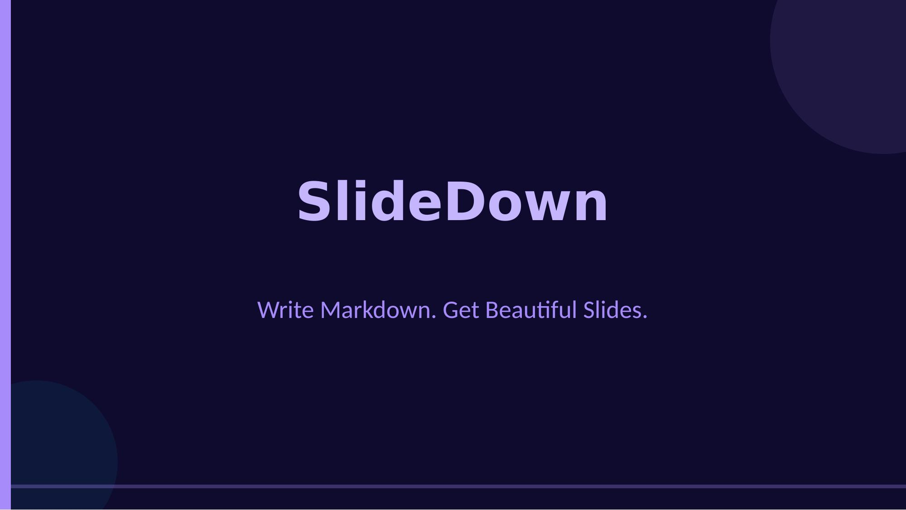
  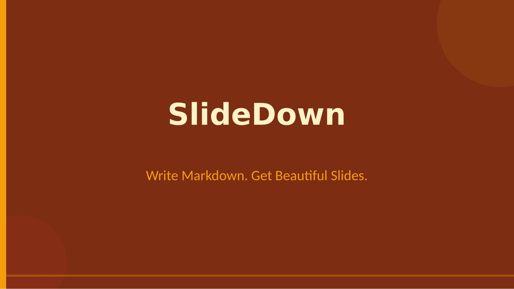
</p>
<p align="center">
  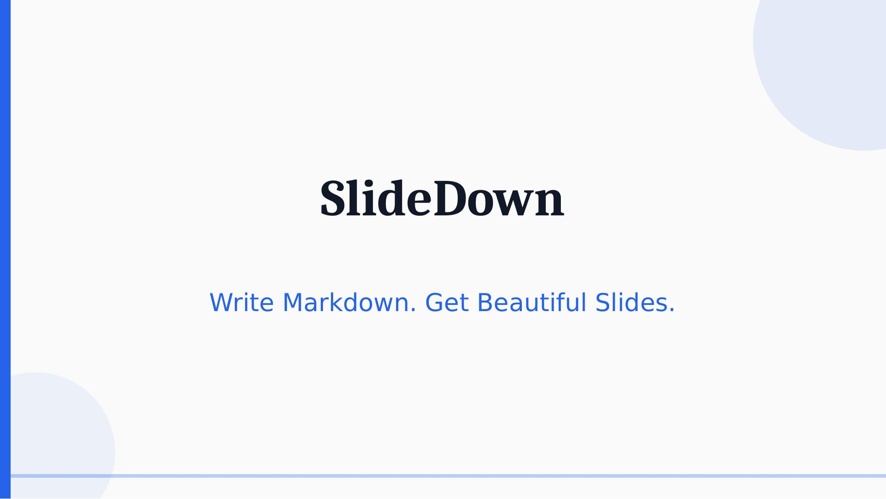
  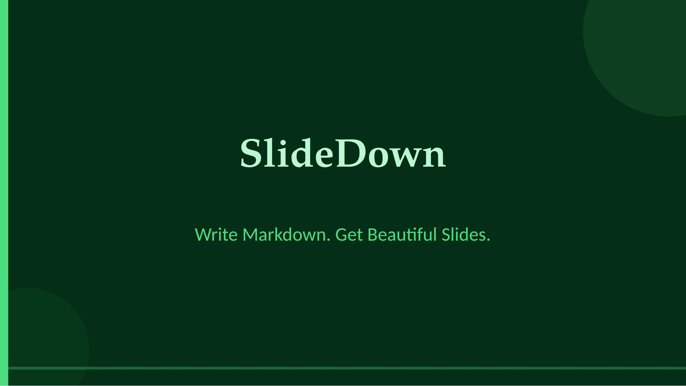
  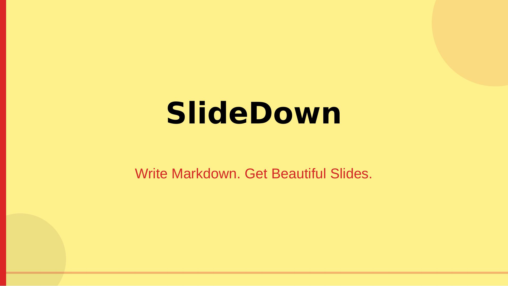
</p>

## Markdown Syntax

SlideDown uses standard Markdown with a few conventions:

```markdown
# Presentation Title
## Optional subtitle

---

## Slide Heading

Regular paragraph text with **bold** and *italic*.

- Bullet point one
- Bullet point two
- Bullet point three

---

## A Quote Slide

> This is a highlighted quote that stands out visually.

---

## Data Table

| Metric | Q1 | Q2 | Q3 |
|--------|-----|-----|-----|
| Revenue | $2M | $3M | $4.5M |
| Users | 10K | 25K | 50K |

---

## Code Example

```python
def hello():
    print("Hello, SlideDown!")
```

<!-- notes: These are speaker notes, invisible on the slide -->
```

### Syntax Reference

| Markdown | Slide Behavior |
|----------|---------------|
| `# Title` | Title/hero slide (centered, large) |
| `---` | New slide separator |
| `## Heading` | Slide heading |
| `> Quote` | Highlighted quote with accent border |
| `- Item` | Styled bullet point |
| `\| Table \|` | Auto-styled data table |
| ` ```lang ``` ` | Code block with dark background |
| `` | Embedded image |
| `<!-- notes: -->` | Speaker notes |
| `**bold**` | Bold emphasis |
| `*italic*` | Italic text |

## Examples

### Slide Types

The converter auto-detects content type and applies the appropriate layout:

<p align="center">
  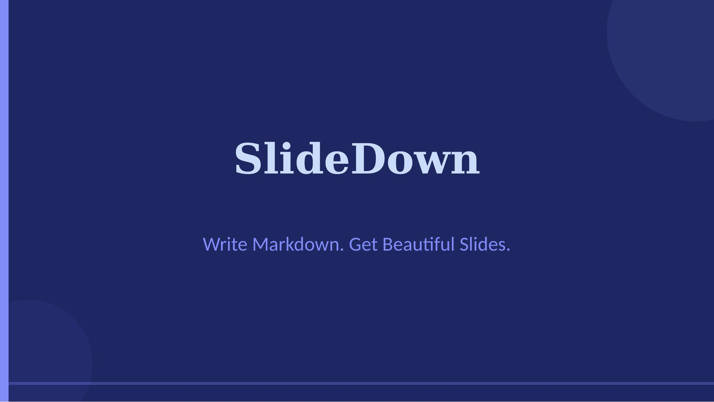
  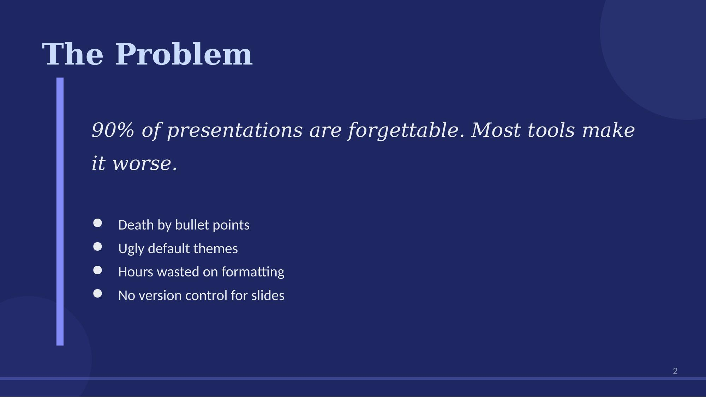
</p>
<p align="center">
  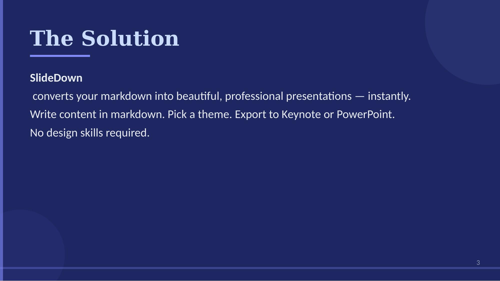
  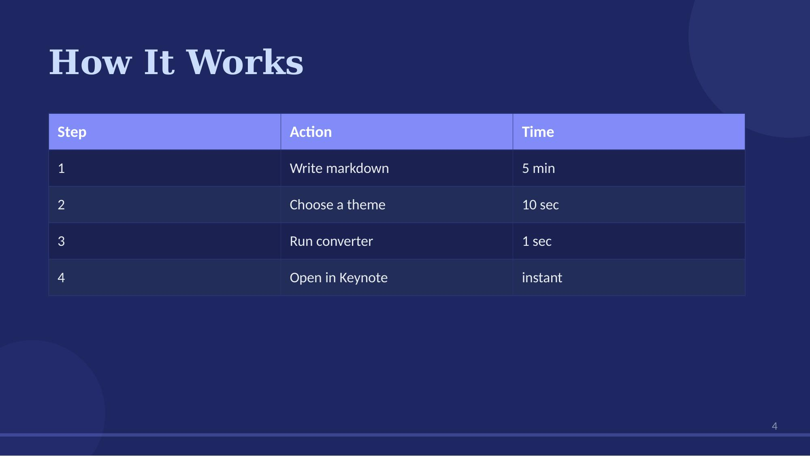
</p>
<p align="center">
  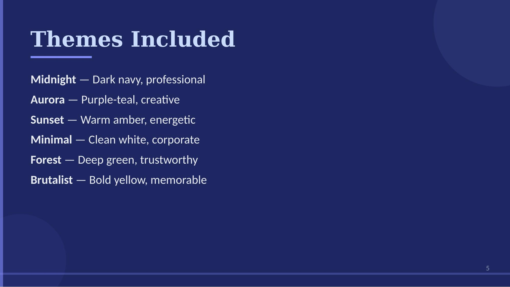
  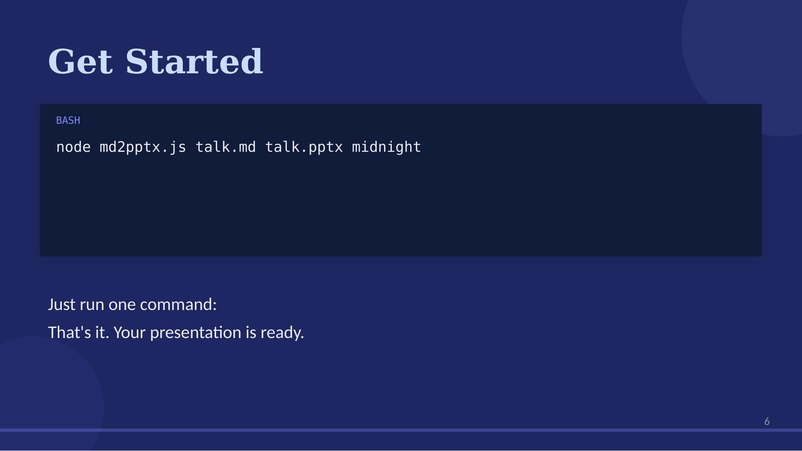
</p>

### Try It

```bash
# Clone this repo
git clone https://github.com/YOUR_USERNAME/slidedown.git
cd slidedown

# Install dependency
npm install -g pptxgenjs

# Convert the demo presentation
node scripts/md2pptx.js examples/demo.md my-slides.pptx midnight

# Try other themes
node scripts/md2pptx.js examples/demo.md my-slides.pptx aurora
node scripts/md2pptx.js examples/demo.md my-slides.pptx sunset
```

## Claude Skill

SlideDown also works as a **Claude Skill** — install it in [Claude Code](https://docs.anthropic.com/en/docs/claude-code) or [Claude.ai Projects](https://claude.ai) to convert Markdown to slides directly from your AI workflow.

### Install as Skill

Download `slidedown.skill` from [Releases](../../releases) and add it to your Claude Code or Claude.ai Project.

### Usage in Claude

Just ask:

> "Convert this markdown into a presentation using the sunset theme"

> "Make slides from my README.md with the midnight theme"

> "Turn these notes into a keynote presentation"

Claude will automatically use the SlideDown skill to generate a `.pptx` file.

## Project Structure

```
slidedown/
├── README.md              # This file
├── SKILL.md               # Claude Skill definition
├── LICENSE                 # MIT License
├── package.json            # npm metadata
├── scripts/
│   └── md2pptx.js          # Main converter (Markdown → PPTX)
├── references/
│   └── themes.md           # Theme color/typography specs
├── examples/
│   └── demo.md             # Sample presentation markdown
└── docs/
    └── screenshots/        # Theme & slide previews
```

## Design Principles

1. **No boring slides** — every slide has visual elements, never just text on white
2. **Typography hierarchy** — clear size/weight contrast between title, heading, body
3. **Color discipline** — 60/30/10 rule for background, content, and accent
4. **Layout variety** — different layouts for titles, quotes, tables, code
5. **Breathing room** — generous margins and spacing
6. **Consistent motif** — each theme has a signature visual pattern

## Roadmap

- [ ] Mermaid diagram support
- [ ] LaTeX/KaTeX formulas
- [ ] Two-column split layout (`<!-- layout: split -->`)
- [ ] Custom CSS per theme
- [ ] Image auto-download and embedding
- [ ] Chart generation from table data
- [ ] CLI npm package (`npx slidedown talk.md`)
- [ ] Community theme marketplace

## Contributing

Contributions are welcome! See [CONTRIBUTING.md](CONTRIBUTING.md) for guidelines.

Ideas for contributions:
- New themes
- Layout improvements
- Markdown syntax extensions
- Bug fixes and edge cases

## License

MIT License — see [LICENSE](LICENSE) for details.

---

<p align="center">
  Made with ❤️ for developers who present
</p>
